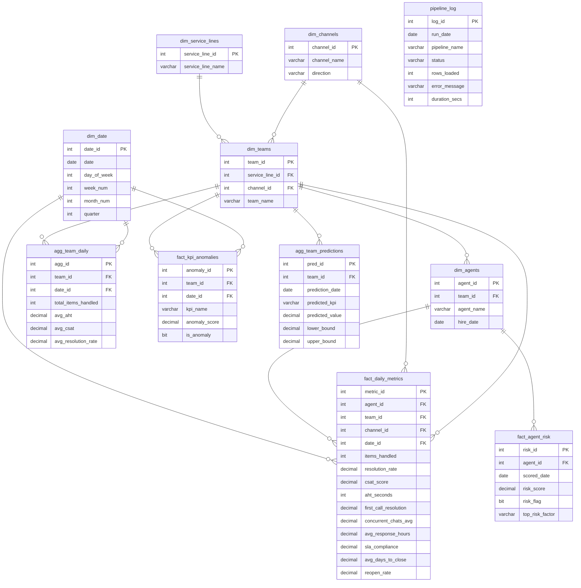

# E-Commerce Contact Centre Performance Monitoring System

End-to-end Azure data engineering pipeline for a simulated e-commerce contact centre. Ingests agent performance data via batch and streaming paths, stores and aggregates it in Azure SQL, applies an ML layer for anomaly detection, agent risk classification, and performance forecasting, and visualises results across Power BI Service and Tableau Public dashboards.

---

## Architecture

Lambda Architecture — two ingestion paths writing to a shared Azure SQL warehouse.

**Batch path (daily, ADF-orchestrated)**
```
Python (generate_data.py)
    → CSVs → ADLS Gen2 (bronze/{channel}/YYYY-MM-DD.csv)
    → ADF Copy Activity
    → Azure SQL: fact_daily_metrics
    → ADF: sp_aggregate_team_metrics
    → Azure SQL: agg_team_daily
    → Power BI
```

**Speed path (event-driven, near real-time)**
```
Python (kafka_producer.py)
    → Upstash Kafka (topic: agent-metrics)
    → Azure Function (kafka_consumer)
    → Azure SQL: fact_daily_metrics
```

Both paths write to the same fact table. The ADF stored procedure aggregates both into `agg_team_daily`. A Python ML layer then produces anomaly flags, agent risk scores, and team forecasts — all stored back in Azure SQL and consumed by both BI platforms.

---

## Business Context

A contact centre for an e-commerce platform with two service lines:

| Service Line | Who They Serve | Traffic |
|---|---|---|
| Customer Service | Buyers / end customers | High volume |
| Seller Service | Merchants / sellers | Low volume |

Each service line operates across 4 channels × 2 directions (inbound + outbound):

| Channel | KPIs |
|---|---|
| Call | AHT, items handled, resolution rate, CSAT, first-call resolution |
| Chat | AHT, items handled, resolution rate, CSAT, concurrent chats avg |
| Email | Items handled, avg response hours, SLA compliance, resolution rate, CSAT |
| Issue Resolution | Items handled, avg days to close, reopen rate, SLA compliance, resolution rate, CSAT |

**2 service lines × 4 channels × 2 directions = 16 teams, 500 agents, 90 days = 45,000 fact rows**

---

## Tech Stack

| Layer | Service | Tier |
|---|---|---|
| Data Lake | Azure Data Lake Storage Gen2 (`agentmonitoringdatalake`) | Free (5 GB/month) |
| Warehouse | Azure SQL Database (`ecommerce_agent_db`, server: `ecommerce-agent-srv-4d4842`) | Free serverless GP_S_Gen5 |
| Orchestration | Azure Data Factory (`agent-monitoring-adf`) | Free (1,000 DIU-hrs/month) |
| Streaming | Upstash Kafka (topic: `agent-metrics`) | Free serverless |
| Functions | Azure Functions (`kafka_consumer`) | Free (1M executions/month) |
| ML | scikit-learn (Python) | Free |
| BI | Power BI Service (browser-based) | Free |
| BI | Tableau Public (Mac-native) | Free |

---

## Schema (Star Schema in Azure SQL)




| Table | Rows | Description |
|---|---|---|
| `dim_service_lines` | 2 | Customer Service, Seller Service |
| `dim_channels` | 8 | 4 channels × 2 directions |
| `dim_teams` | 16 | One per channel/direction/service-line combination |
| `dim_agents` | 500 | Agent roster with team assignments |
| `dim_date` | 90 | Date dimension for the simulation window |
| `fact_daily_metrics` | 45,000 | Raw daily KPIs per agent; channel-specific columns NULL where not applicable |
| `agg_team_daily` | ~1,440 | Team-level aggregates refreshed daily via MERGE stored procedure |
| `fact_kpi_anomalies` | varies | Anomaly flags on team KPIs — Call, Chat, Email, IR (Isolation Forest) |
| `fact_agent_risk` | ~500/week | Per-agent risk score and flag from ML classifier |
| `agg_team_predictions` | ~16/week | Next-week team KPI forecasts from regression model |
| `pipeline_log` | 1 per run | ADF pipeline run status, row counts, and error messages |

---

## Azure Infrastructure (Live)

| Resource | Name | Status |
|---|---|---|
| Resource Group | `agent-monitoring-rg` (East US) | Active |
| SQL Server | `ecommerce-agent-srv-4d4842` (West US 2) | Ready |
| SQL Database | `ecommerce_agent_db` (free serverless GP_S_Gen5) | Online — all 11 tables deployed |
| ADLS Gen2 | `agentmonitoringdatalake` (West US 2) | Active |
| Container | `bronze` | 360 CSVs loaded (90 days × 4 channels) |

---

## Repository Structure

```
├── sql/
│   ├── 01_schema.sql           # Dim + fact + agg table definitions
│   ├── 02_stored_procedure.sql # sp_aggregate_team_metrics (MERGE pattern, idempotent)
│   └── 03_pipeline_log.sql     # pipeline_log table + insert logic
├── scripts/
│   ├── generate_data.py        # Simulates 90 days of agent data, uploads to ADLS Gen2
│   ├── kafka_producer.py       # Streams agent events to Upstash Kafka topic
│   ├── anomaly_detection.py    # Flags KPI anomalies → fact_kpi_anomalies
│   ├── classify_agent_risk.py  # Risk classifier → fact_agent_risk
│   └── predict_performance.py  # Team KPI forecast → agg_team_predictions
├── azure_functions/
│   └── kafka_consumer/         # Azure Function: reads Kafka topic → writes to SQL
├── adf/
│   └── pipeline_export.json    # ARM template export of pl_daily_team_aggregation
├── powerbi/                    # Power BI Service screenshots + published link
├── tableau/                    # Tableau Public screenshots + published link
├── screenshots/                # Combined dashboard screenshots
└── README.md
```

---

## ADF Pipeline: `pl_daily_team_aggregation`

- **Trigger:** Daily at 02:00 UTC
- **Parameter:** `ExecutionDate` (String)
- **Activities:**
  1. Lookup — row count check for the execution date
  2. If Condition — skips downstream if no rows found
  3. Copy Activity — loads Blob CSVs into `fact_daily_metrics`
  4. Execute Stored Procedure — runs `sp_aggregate_team_metrics`

The pipeline logs every run (success and failure) to `pipeline_log` via TRY/CATCH inside the stored procedure.

---

## ML Layer

Three scikit-learn scripts run after the ADF aggregation step:

| Script | Input | Output table | Method |
|---|---|---|---|
| `anomaly_detection.py` | `agg_team_daily` | `fact_kpi_anomalies` | Isolation Forest |
| `classify_agent_risk.py` | `fact_daily_metrics` | `fact_agent_risk` | Random Forest classifier |
| `predict_performance.py` | `agg_team_daily` | `agg_team_predictions` | Linear Regression |

No paid ML services — scikit-learn only, results stored back in Azure SQL.

---

## Power BI Service Dashboard (10 Pages)

| Page | Contents |
|---|---|
| 1. Executive Overview | KPI cards + CSAT trend line |
| 2. Channel Performance | Channel KPIs vs targets |
| 3. Team Scorecard | 16 teams with RAG (Red/Amber/Green) formatting |
| 4. Customer vs Seller | Service line comparison |
| 5. Agent Drill-Down | 90-day breakdown for any individual agent |
| 6. Trends | Volume + quality metrics over 90 days |
| 7. Pipeline Health | `pipeline_log` status view |
| 8. KPI Alerts | Anomaly flags from `fact_kpi_anomalies` |
| 9. Agent Risk | At-risk agent heat map from `fact_agent_risk` |
| 10. Forecast | Next-week team KPI predictions from `agg_team_predictions` |

## Tableau Public Dashboard

Complementary dashboard covering the core KPIs — built on the same Azure SQL data, published publicly on Tableau Public for portfolio sharing.

---

## Real-World Ingestion Patterns

In a production environment, the Python-generated CSVs would be replaced by:

| Pattern | Source → ADLS Gen2 |
|---|---|
| Native connector | Genesys Cloud exports directly to Blob (zero code) |
| Webhook + Function | Zendesk event → Azure Function → Blob (near real-time) |
| ADF HTTP Activity | ADF pulls from any REST API → Blob (most common in DE roles) |

This project simulates the same landing-zone pattern — the ADF pipeline and SQL schema are identical to what production would use.

---

## License

[Prosperity Public License 3.0](LICENSE) — free for non-commercial use.
